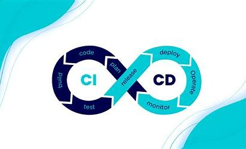
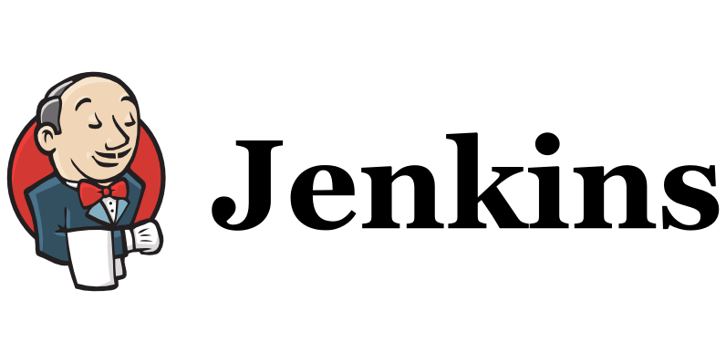

# Tech 201 CI/CD

## DevOps Culture and CICD
DevOps, in a nutshell, is a culture that combines software development and IT operations, and have them work collaboratively throughout the software development life-cylce through development to production. This is achieved through a set of practices that automate the processes between software development and IT teams, so that they can build , test, and release software faster.

## What is CI, CD and CDE?
CI/CD is considered the backbone of DevOps practices and automation, it plays a vital role in DevOps culture, growing numbers of companies are able to release their software in minutes with the adoption of CI/CD practices.

CI/CD is a method to frequently deliver apps to customers by introducing automation into the stages of app development. The main concepts attributed to CI/CD are continuous integration, continuous delivery, and continuous deployment. CI/CD serves as the solution to the problems integrating new code can cause for develoment and operations teams  (AKA "integration hell"). Speifically, CI/CD introduces ongoing automation and continuous monitoring throughout the lifecyle of apps, from integration testing phases to delivery and deployment. Taken together, these connected practices are often referred to as the **CICD pipeline**.

Lets look specifically at what each of these are:

### Continuous Integration (CI)
**Continuous integration** is where developers merge/commit code into a centralised repository, with a fully automated build and test process used to assess whether the newly merged code is correct. This allows developers to receive feedback within minutes, this allows them to avoid integration (or merge) hell that would usually happen when developers merge their code much further down the line, which could become very time consuming and expensive!

### Continuous Delivery (CD)
**Continuous delivery** is an extension of continuous integration that involves the automation of further stages of the pipeline, enabling software developers to release new changes to customers quickly. With continuous delivery, every code change is built, tested and then pushed to a non-production testing or staging environment. Note with continuous delivery, pushing changes to the production environment would be done manually.

### Continuous Deployment (CDE)
**Continuous deployment**, which may sometimes also be referred to as the "CD" in CI/CD, can refer to automatically releasing a developers changes from the repository to production. Basically with continuous deployment, the entire CI/CD pipeline is automated with no human intervention, from integration to deploying the changes to the production environment, the only thing that will prevent a change to be deployed in this case is a failed test. This is the key difference between continuous delivery and continuous deployment.

## Jenkins

**Jenkins** is an open source automation server. It helps automate the parts of software development related to building, testing and deploying, facilitating continuous integration and continuous delivery. This makes it easy for developers to continuously work  on the betterment of the productby inmtegrating changes to the project. Jenkins automates the software builds in a continuous manner and lets the developers know about the errors at an early stage.

Some of the possible staps that can be performed using Jenkins are:
- Software build using build systems such as Gradle, Maven etc.
- Automation testing using test frameworks such as Selenium
- Execute test scripts using Windows terminal, Linux shell etc.
- Achieve test results and perform post actions
- Continuous Integration where the artifacts are automatically created and tested. 

### Why should we use Jenkins?
Jenkins is one of the, if not the most popular CI/CD tools. Some of the reasons is because:
- **Easy to install and configure** for almost all the popular operating systems such as Windows and Mac OS.
- It is **open-source**, thus free to use. 
- Jenkins has a **strong community** which makes it a powerful CI/CD tool.
- Jenkins is designed in such a manner that makes it relatively **easy to distribute** work accross multpile machines and platforms for the acceleratied build, testing, and deployment.

# Sources
https://medium.com/@ahshahkhan/devops-culture-and-cicd-3761cfc62450

https://www.redhat.com/en/topics/devops/what-is-ci-cd

https://www.atlassian.com/continuous-delivery/continuous-integration

https://aws.amazon.com/devops/continuous-delivery/#:~:text=Continuous%20delivery%20automates%20the%20entire,is%20triggered%20by%20the%20developer.

https://en.wikipedia.org/wiki/Jenkins_(software)

https://www.lambdatest.com/blog/what-is-jenkins/