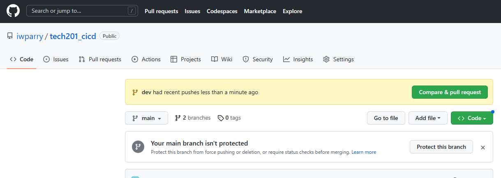
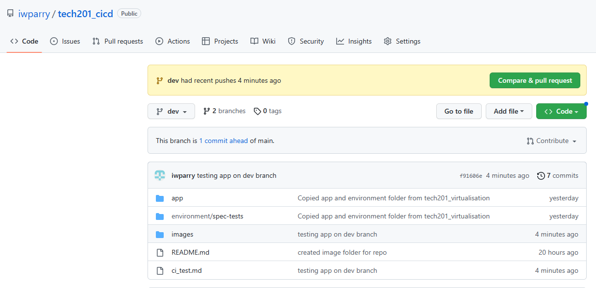
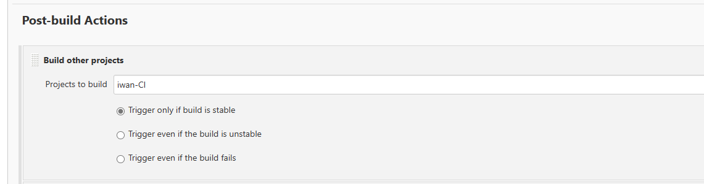
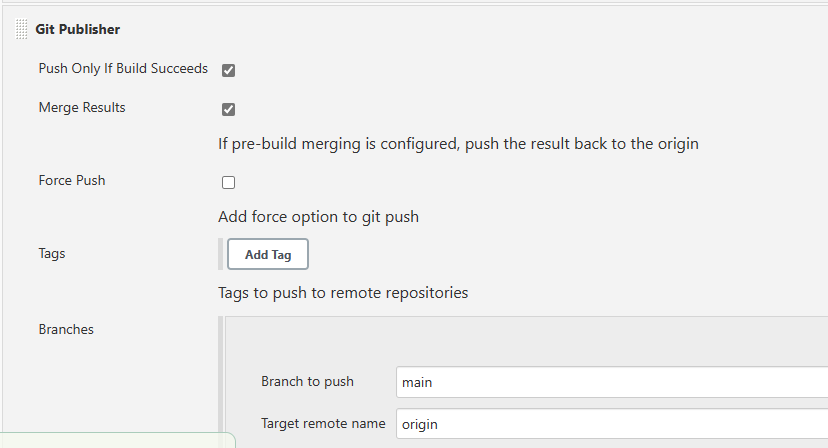

# CI Test with GitHub and Jenkins

## Tests
1. This is my first webhook test! - Success
2. Testing that my `app` works in the `dev` branch - Success
3. Testing the automated merging of our `dev` and `main` branches if our jobs are successful. - Success
4. Testing if the merge is successful, our main branch is sent to an EC2 Instance - Nginx is running but repo is not on EC2 - Testing job 3 again, need to have app folder migrated to ec2 instance

### Webhook Testing 
We add a webhook to our Github repo settings so that any git push we make to that repo will trigger our job in Jenkins.

## CICD Pipeline
We start off by making a `dev` branch in our repositiry. In our repo we select branches and click on 'new branch' and enter our new branch name.

In our gitbash terminal we can update the details of our branches and change branch with the following commands:

`git fetch` - gives output
```
From https://github.com/iwparry/tech201_cicd
 * [new branch]      dev        -> origin/dev
```
`git checkout dev` - gives output
```
Switched to a new branch 'dev'
M       ci_test.md
branch 'dev' set up to track 'origin/dev'.
```

### Testing app in our dev branch
We test our app in the dev branch via the following configuration to our build.

We need to ensure that this is being done on our `dev` branch, not `main`.

We push these changes to our `dev` branch in the same way as we would do main but with this command:
```
git push -u origin dev
```
As we can see here Github lets us know that something has been pushed to our `dev` branch!

If we switch to our dev branch on Github we can see our commits as shown below.


### Automating merging dev and main branches
Now that we have verified that our app works on our `dev` branch, we now want to automate the process of merging our `dev` branch with our `main` branch.
To do this we create a new item in Jenkins and configure it similarly to our first Jenkins job.

ensure that the job is connected to our desired repo with the correct credentials (SSH key)

In this particular job what we want is to go to 'post-build actions' and select 'build other projects'. Here we set our project to be built only if our first job has run successfully.


After this we select 'git publisher' letting Jenkins know that we want to merge our branch (`dev`) with our main branch on Github.


