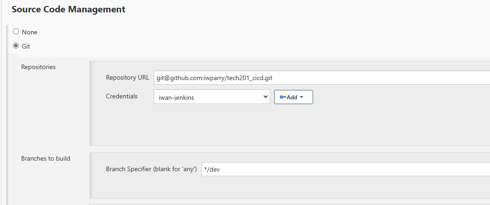

# CI Test with GitHub and Jenkins

## Tests
1. This is my first webhook test! - Success
2. Testing that my `app` works in the `dev` branch

### Webhook Testing 
We add a webhook to our Github repo settings so that any git push we make to that repo will trigger our job in Jenkins.

## CICD Pipeline
We start off by making a `dev` branch in our repositiry. In our repo we select branches and click on 'new branch' and enter our new branch name.

In our gitbash terminal we can update the details of our branches and change branch with the following commands:

`git fetch` - gives output
```
From https://github.com/iwparry/tech201_cicd
 * [new branch]      dev        -> origin/dev
```
`git checkout dev` - gives output
```
Switched to a new branch 'dev'
M       ci_test.md
branch 'dev' set up to track 'origin/dev'.
```

### Testing app in our dev branch
We test our app in the dev branch via the following configuration to our build.

We need to ensure that this is being done on our `dev` branch, not `main`.

